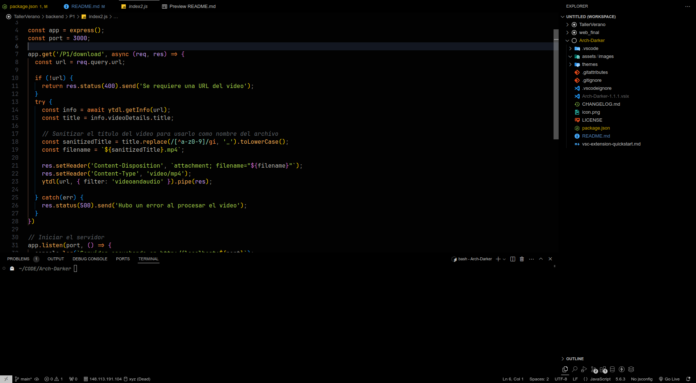
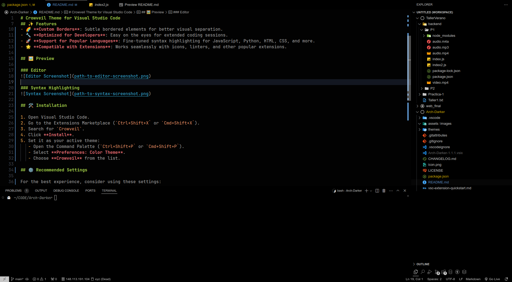

# Crowveil Theme for Visual Studio Code

## 🌌 Overview

**Crowveil** is a set of modified themes for Visual Studio Code, based on the popular **Tokyo Night** and **Ayu Dark Bordered** themes. These themes offer a refined, minimalist visual experience, perfect for developers looking for a dark and stylish interface.

## ✨ Features

- 🎨 **Adjusted Color Palette**: Optimized dark tones with vibrant syntax highlighting.
- 🌈 **Custom Borders**: Subtle bordered elements for better visual separation.
- 🔧 **Designed for Developers**: Ideal for long coding sessions.
- 🚀 **Supports Multiple Languages**: Includes fine-tuned syntax highlighting for JavaScript, Python, HTML, CSS, and more.
- 🌟 **Seamless Integration with Extensions**: Works flawlessly with icons, linters, and other popular extensions.
  

## 🖼️ Preview

### Editor


### Syntax Highlighting


## 🛠️ Installation

1. Open Visual Studio Code.
2. Go to the Extensions Marketplace (`Ctrl+Shift+X` or `Cmd+Shift+X`).
3. Search for `Crowveil`.
4. Click **Install**.
5. Set it as your active theme:
   - Open the Command Palette (`Ctrl+Shift+P` or `Cmd+Shift+P`).
   - Select **Preferences: Color Theme**.
   - Choose **Crowveil** from the list.

## ⚙️ Recommended Settings

For the best experience, consider using these settings:

```json
{
  "workbench.colorTheme": "Crowveil",
  "editor.fontFamily": "Fira Code, Consolas, 'Courier New', monospace",
  "editor.fontLigatures": true,
  "editor.lineHeight": 22,
  "editor.letterSpacing": 0.5
}
